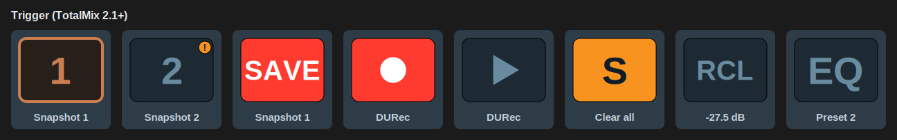

[← Documentation home](../index.md)

# Trigger (TotalMix 2.1+)

One-shot commands over Global OSC. Key only.

| Group | Actions | Settings |
|---|---|---|
| Snapshots and layouts | Load snapshot 1 to 8, Save snapshot 1 to 8, Load layout preset | Snapshot / Layout number; *Guard* on Save |
| Cue and monitoring | Cue: step through outputs, Monitor path: step through slots | Output list / Slot list |
| Presets | Load EQ preset (channel), Load dynamics preset (channel), Load Room EQ preset (output), Load reverb preset, Load echo preset | Preset number; Bus and Channel for the per-channel ones |
| Mixer | Undo, Redo, Recall volume, Clear all solos, Clear all mutes | none |
| DURec | Play, Pause, Stop, Record, Next, Previous | none |
| Window | Show TotalMix window, Hide TotalMix window | none |

## State

A loaded snapshot's key takes TotalMix's own look for it, an orange number and outline on a dark face, including loads made in the mixer window, which the classic actions cannot see. Once you change anything after loading, the outline goes away until the snapshot is loaded again; tick *Blink the outline while the loaded snapshot has been changed* to have it blink instead, as TotalMix's does.

DURec keys light from the transport state: record red while recording, play green while playing, pause and stop accordingly.

*Save snapshot* with *Guard* lights while its snapshot is loaded and has been changed; *Clear all solos* and *Clear all mutes* light while anything is set. Everything else is stateless and stays unlit.

## Notes

- DURec Stop during a recording needs two presses (TotalMix behaviour; the plugin sends 1.0, not the value above 10 that bypasses it).

## Appearance

Snapshots and layouts show their number on the face; presets show their section; DURec, undo/redo and show/hide use symbols. "Icon" restores the classic artwork.

The output and slot lists are built with *Add*, *Remove last* and *Clear* beside a picker. The two cycle keys always draw the TotalMix-style face.

*Cue: step through outputs* advances the cue along the outputs listed, and clears it after the last one. Cue is a single control-room assignment, so advancing releases the previous output on its own.

*Load snapshot* has an optional *Guard*: while the loaded snapshot has unsaved changes, every guarded snapshot key shows a small orange mark, the first press arms the key instead of loading, and a second press within 2.5 s loads and discards the changes.

*Save snapshot* writes the current mix into the slot; TotalMix confirms by reporting that snapshot as loaded again. With *Guard* ticked the key lights only while that snapshot is loaded and has been changed since, a press on anything else does nothing, and a valid press arms the key and asks for a second one within 2.5 s. Without the guard every press overwrites the slot.

*Recall volume* shows the level it recalls to on its face, so you know before you press.

*Clear all solos* switches off every mix-node solo and channel PFL in the mixer and lights while anything is soloed; *Clear all mutes* does the same for every channel mute, Main Out included. These are not TotalMix's own Solo and Mute buttons, which only disable soloing or muting while leaving the individual states set; these keys remove them.

The monitor key shows the slot it last selected on its face. *Monitor path: step through slots* steps a slot shared by every button: Main Out, Speaker B and the four Phones outputs, or the subset listed. Volume buttons set to *Follow the monitor path* control whichever slot is current, so one key and one fader cover the whole control room. The slot is stored globally, so it survives a restart and is the same on every Stream Deck.

